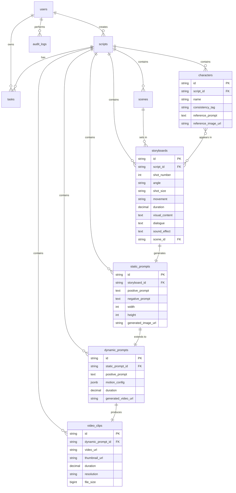

# AI视频生成智能体系统 - 数据库设计文档

> 版本：v1.0  
> 日期：2026-07-14  
> 状态：草案

---

## 1. 文档概述

本文档定义系统数据库设计，包含ER图、表结构、索引策略、迁移规范。数据库采用 **PostgreSQL 16**，ORM使用 **SQLAlchemy 2.0**（异步模式）。

---

## 2. ER关系总览

```
users ──< scripts ──< characters
                 ──< scenes
                 ──< storyboards >── characters (M:N)
                                >── scenes (N:1)
                 ──< static_prompts >── storyboards (N:1)
                                      >── characters (M:N)
                 ──< dynamic_prompts >── static_prompts (N:1)
                                       >── storyboards (N:1)
                 ──< video_clips >── dynamic_prompts (N:1)
                 ──< tasks
                 ──< audit_logs

system_configs (全局配置)
```

**核心关系说明：**
- 一个用户可创建多个剧本（1:N）
- 一个剧本包含多个角色、场景、分镜（1:N）
- 一个分镜关联多个角色（M:N）、一个场景（N:1）
- 一个分镜对应一条静态提示词和一条动态提示词（1:1）
- 一条动态提示词对应一条视频片段（1:1）

---

## 3. 表结构设计

### 3.1 users - 用户表

| 字段 | 类型 | 约束 | 说明 |
|------|------|------|------|
| id | VARCHAR(36) | PK | 用户ID (UUID) |
| username | VARCHAR(64) | UNIQUE, NOT NULL | 用户名 |
| email | VARCHAR(255) | UNIQUE, NOT NULL | 邮箱 |
| password_hash | VARCHAR(255) | NOT NULL | 密码哈希 (bcrypt) |
| avatar_url | VARCHAR(500) | | 头像URL |
| role | VARCHAR(20) | DEFAULT 'user' | 角色: admin/user |
| is_active | BOOLEAN | DEFAULT TRUE | 是否激活 |
| last_login_at | TIMESTAMP | | 最后登录时间 |
| created_at | TIMESTAMP | DEFAULT NOW() | 创建时间 |
| updated_at | TIMESTAMP | DEFAULT NOW() | 更新时间 |

**索引：**
- `idx_users_username` ON (username)
- `idx_users_email` ON (email)

---

### 3.2 scripts - 剧本表

| 字段 | 类型 | 约束 | 说明 |
|------|------|------|------|
| id | VARCHAR(36) | PK | 剧本ID |
| user_id | VARCHAR(36) | FK -> users.id, NOT NULL | 创建者 |
| title | VARCHAR(200) | NOT NULL | 剧本标题 |
| content | TEXT | NOT NULL | 剧本正文 |
| genre | VARCHAR(50) | | 类型: 悬疑/动作/爱情等 |
| description | TEXT | | 剧本简介 |
| plot_outline | TEXT | | 剧情大纲（LLM生成） |
| status | VARCHAR(20) | DEFAULT 'draft' | draft/parsed/storyboarded/prompted/video_done |
| metadata | JSONB | DEFAULT '{}' | 扩展元数据 |
| created_at | TIMESTAMP | DEFAULT NOW() | |
| updated_at | TIMESTAMP | DEFAULT NOW() | |

**索引：**
- `idx_scripts_user_id` ON (user_id)
- `idx_scripts_status` ON (status)
- `idx_scripts_created_at` ON (created_at DESC)

---

### 3.3 characters - 角色表

| 字段 | 类型 | 约束 | 说明 |
|------|------|------|------|
| id | VARCHAR(36) | PK | 角色ID |
| script_id | VARCHAR(36) | FK -> scripts.id, NOT NULL | 所属剧本 |
| name | VARCHAR(100) | NOT NULL | 角色名 |
| role | VARCHAR(50) | | 角色定位: 主角/配角/群演 |
| appearance | TEXT | | 外貌描述 |
| clothing | TEXT | | 服装描述 |
| personality | TEXT | | 性格描述 |
| consistency_tag | VARCHAR(200) | | 一致性标签（用于IPAdapter） |
| reference_prompt | TEXT | | 参考图生成提示词 |
| reference_image_url | VARCHAR(500) | | 参考图URL |
| sort_order | INT | DEFAULT 0 | 排序 |
| created_at | TIMESTAMP | DEFAULT NOW() | |
| updated_at | TIMESTAMP | DEFAULT NOW() | |

**索引：**
- `idx_characters_script_id` ON (script_id)
- `idx_characters_consistency_tag` ON (consistency_tag)

---

### 3.4 scenes - 场景表

| 字段 | 类型 | 约束 | 说明 |
|------|------|------|------|
| id | VARCHAR(36) | PK | 场景ID |
| script_id | VARCHAR(36) | FK -> scripts.id, NOT NULL | 所属剧本 |
| name | VARCHAR(100) | NOT NULL | 场景名 |
| location | VARCHAR(200) | | 地点 |
| time_of_day | VARCHAR(50) | | 时间: 白天/夜晚/黄昏 |
| weather | VARCHAR(50) | | 天气 |
| environment | TEXT | | 环境描述 |
| lighting | TEXT | | 光影描述 |
| atmosphere | TEXT | | 氛围描述 |
| scene_prompt | TEXT | | 场景提示词（英文） |
| sort_order | INT | DEFAULT 0 | 排序 |
| created_at | TIMESTAMP | DEFAULT NOW() | |
| updated_at | TIMESTAMP | DEFAULT NOW() | |

**索引：**
- `idx_scenes_script_id` ON (script_id)

---

### 3.5 storyboards - 分镜表

| 字段 | 类型 | 约束 | 说明 |
|------|------|------|------|
| id | VARCHAR(36) | PK | 分镜ID |
| script_id | VARCHAR(36) | FK -> scripts.id, NOT NULL | 所属剧本 |
| shot_number | INT | NOT NULL | 分镜号 |
| angle | VARCHAR(50) | | 角度: 俯拍/仰拍/平视等 |
| shot_size | VARCHAR(50) | | 景别: 远景/全景/中景/近景/特写 |
| movement | VARCHAR(100) | | 运动: 固定/推进/拉远/平移/环绕 |
| duration | DECIMAL(5,2) | | 时长(秒) |
| visual_content | TEXT | | 画面内容描述 |
| dialogue | TEXT | | 台词 |
| sound_effect | TEXT | | 音效 |
| scene_id | VARCHAR(36) | FK -> scenes.id | 关联场景 |
| sort_order | INT | DEFAULT 0 | 排序 |
| created_at | TIMESTAMP | DEFAULT NOW() | |
| updated_at | TIMESTAMP | DEFAULT NOW() | |

**索引：**
- `idx_storyboards_script_id` ON (script_id)
- `idx_storyboards_shot_number` ON (script_id, shot_number)

---

### 3.6 storyboard_characters - 分镜角色关联表（M:N）

| 字段 | 类型 | 约束 | 说明 |
|------|------|------|------|
| storyboard_id | VARCHAR(36) | FK -> storyboards.id | 分镜ID |
| character_id | VARCHAR(36) | FK -> characters.id | 角色ID |

**主键：** (storyboard_id, character_id)

---

### 3.7 static_prompts - 静态提示词表

| 字段 | 类型 | 约束 | 说明 |
|------|------|------|------|
| id | VARCHAR(36) | PK | 提示词ID |
| script_id | VARCHAR(36) | FK -> scripts.id, NOT NULL | 所属剧本 |
| storyboard_id | VARCHAR(36) | FK -> storyboards.id, NOT NULL | 关联分镜 |
| shot_number | INT | NOT NULL | 分镜号（冗余便于查询） |
| positive_prompt | TEXT | NOT NULL | 正面提示词 |
| negative_prompt | TEXT | | 负面提示词 |
| scene_ref | VARCHAR(36) | FK -> scenes.id | 关联场景 |
| width | INT | DEFAULT 1024 | 图片宽度 |
| height | INT | DEFAULT 576 | 图片高度 |
| seed | BIGINT | DEFAULT -1 | 随机种子 |
| steps | INT | DEFAULT 20 | 采样步数 |
| cfg_scale | DECIMAL(3,1) | DEFAULT 7.0 | CFG尺度 |
| sampler | VARCHAR(50) | DEFAULT 'dpmpp_2m' | 采样器 |
| generated_image_url | VARCHAR(500) | | 生成图片URL |
| image_status | VARCHAR(20) | DEFAULT 'pending' | pending/generating/completed/failed |
| created_at | TIMESTAMP | DEFAULT NOW() | |
| updated_at | TIMESTAMP | DEFAULT NOW() | |

**索引：**
- `idx_static_prompts_script_id` ON (script_id)
- `idx_static_prompts_storyboard_id` ON (storyboard_id)

---

### 3.8 static_prompt_characters - 静态提示词角色关联表

| 字段 | 类型 | 约束 | 说明 |
|------|------|------|------|
| static_prompt_id | VARCHAR(36) | FK -> static_prompts.id | |
| character_id | VARCHAR(36) | FK -> characters.id | |

**主键：** (static_prompt_id, character_id)

---

### 3.9 dynamic_prompts - 动态提示词表

| 字段 | 类型 | 约束 | 说明 |
|------|------|------|------|
| id | VARCHAR(36) | PK | 提示词ID |
| script_id | VARCHAR(36) | FK -> scripts.id, NOT NULL | 所属剧本 |
| storyboard_id | VARCHAR(36) | FK -> storyboards.id, NOT NULL | 关联分镜 |
| static_prompt_id | VARCHAR(36) | FK -> static_prompts.id, NOT NULL | 关联静态提示词 |
| shot_number | INT | NOT NULL | 分镜号 |
| positive_prompt | TEXT | NOT NULL | 正面提示词（含运动描述） |
| negative_prompt | TEXT | | 负面提示词 |
| motion_config | JSONB | DEFAULT '{}' | 运动配置 |
| duration | DECIMAL(5,2) | | 视频时长(秒) |
| fps | INT | DEFAULT 24 | 帧率 |
| static_image_url | VARCHAR(500) | | 静态图片URL |
| generated_video_url | VARCHAR(500) | | 生成视频URL |
| video_status | VARCHAR(20) | DEFAULT 'pending' | pending/generating/completed/failed |
| created_at | TIMESTAMP | DEFAULT NOW() | |
| updated_at | TIMESTAMP | DEFAULT NOW() | |

**motion_config JSONB结构：**
```json
{
  "type": "zoom_in",
  "speed": "slow",
  "direction": "forward",
  "intensity": 0.5
}
```

**索引：**
- `idx_dynamic_prompts_script_id` ON (script_id)
- `idx_dynamic_prompts_static_prompt_id` ON (static_prompt_id)

---

### 3.10 video_clips - 视频片段表

| 字段 | 类型 | 约束 | 说明 |
|------|------|------|------|
| id | VARCHAR(36) | PK | 视频ID |
| script_id | VARCHAR(36) | FK -> scripts.id, NOT NULL | 所属剧本 |
| dynamic_prompt_id | VARCHAR(36) | FK -> dynamic_prompts.id | 关联动态提示词 |
| shot_number | INT | NOT NULL | 分镜号 |
| video_url | VARCHAR(500) | | 视频文件URL |
| thumbnail_url | VARCHAR(500) | | 缩略图URL |
| duration | DECIMAL(5,2) | | 时长(秒) |
| resolution | VARCHAR(20) | | 分辨率: 1024x576 |
| file_size | BIGINT | | 文件大小(字节) |
| format | VARCHAR(10) | DEFAULT 'mp4' | 格式 |
| status | VARCHAR(20) | DEFAULT 'pending' | pending/completed/failed |
| created_at | TIMESTAMP | DEFAULT NOW() | |
| updated_at | TIMESTAMP | DEFAULT NOW() | |

**索引：**
- `idx_video_clips_script_id` ON (script_id)
- `idx_video_clips_dynamic_prompt_id` ON (dynamic_prompt_id)

---

### 3.11 tasks - 异步任务表

| 字段 | 类型 | 约束 | 说明 |
|------|------|------|------|
| id | VARCHAR(36) | PK | 任务ID |
| user_id | VARCHAR(36) | FK -> users.id | 发起用户 |
| script_id | VARCHAR(36) | FK -> scripts.id | 关联剧本 |
| type | VARCHAR(50) | NOT NULL | 任务类型 |
| status | VARCHAR(20) | DEFAULT 'pending' | pending/running/completed/failed/cancelled |
| progress | INT | DEFAULT 0 | 进度0-100 |
| current_step | VARCHAR(200) | | 当前步骤描述 |
| input_params | JSONB | | 输入参数 |
| result | JSONB | | 执行结果 |
| error_message | TEXT | | 错误信息 |
| error_code | INT | | 错误码 |
| celery_task_id | VARCHAR(200) | | Celery任务ID |
| started_at | TIMESTAMP | | 开始时间 |
| completed_at | TIMESTAMP | | 完成时间 |
| created_at | TIMESTAMP | DEFAULT NOW() | |
| updated_at | TIMESTAMP | DEFAULT NOW() | |

**任务类型(type)枚举：** `parse_script` / `generate_storyboard` / `generate_static_prompt` / `generate_dynamic_prompt` / `generate_image` / `generate_video` / `merge_videos`

**索引：**
- `idx_tasks_user_id` ON (user_id)
- `idx_tasks_script_id` ON (script_id)
- `idx_tasks_status` ON (status)
- `idx_tasks_celery_task_id` ON (celery_task_id)

---

### 3.12 system_configs - 系统配置表

| 字段 | 类型 | 约束 | 说明 |
|------|------|------|------|
| id | SERIAL | PK | 自增ID |
| config_key | VARCHAR(100) | UNIQUE, NOT NULL | 配置键 |
| config_value | JSONB | NOT NULL | 配置值 |
| category | VARCHAR(50) | NOT NULL | 分类: llm/image_engine/video_engine |
| description | TEXT | | 配置描述 |
| is_sensitive | BOOLEAN | DEFAULT FALSE | 是否敏感（API Key等） |
| created_at | TIMESTAMP | DEFAULT NOW() | |
| updated_at | TIMESTAMP | DEFAULT NOW() | |

**预置配置项：**
- `llm_config` - LLM配置（provider, model, api_key, base_url等）
- `image_engine_config` - 图片引擎配置（type, server_url等）
- `video_engine_config` - 视频引擎配置（type, server_url等）

---

### 3.13 audit_logs - 审计日志表

| 字段 | 类型 | 约束 | 说明 |
|------|------|------|------|
| id | BIGSERIAL | PK | 自增ID |
| user_id | VARCHAR(36) | FK -> users.id | 操作用户 |
| action | VARCHAR(50) | NOT NULL | 操作类型 |
| resource_type | VARCHAR(50) | | 资源类型 |
| resource_id | VARCHAR(36) | | 资源ID |
| old_value | JSONB | | 修改前值 |
| new_value | JSONB | | 修改后值 |
| ip_address | VARCHAR(45) | | IP地址 |
| user_agent | VARCHAR(500) | | User-Agent |
| created_at | TIMESTAMP | DEFAULT NOW() | |

**索引：**
- `idx_audit_logs_user_id` ON (user_id)
- `idx_audit_logs_resource` ON (resource_type, resource_id)
- `idx_audit_logs_created_at` ON (created_at DESC)

---

## 4. 完整ER图（Mermaid）



---

## 5. 数据库迁移规范

### 5.1 迁移工具

使用 **Alembic** 进行数据库迁移管理。

```bash
# 初始化Alembic
alembic init alembic

# 生成迁移脚本
alembic revision --autogenerate -m "create initial tables"

# 执行迁移
alembic upgrade head

# 回滚
alembic downgrade -1
```

### 5.2 迁移规范

1. **命名规范：** 迁移文件命名为 `YYYYMMDD_HHmm_description.py`
2. **版本管理：** 每个迁移必须包含 `upgrade()` 和 `downgrade()` 方法
3. **数据迁移：** 表结构变更和数据变更分离，先改结构后迁数据
4. **零停机：** 避免锁表操作，大表变更使用 `CREATE INDEX CONCURRENTLY`
5. **测试：** 迁移脚本需在测试环境验证后方可应用于生产

### 5.3 初始数据

```sql
-- 系统配置初始数据
INSERT INTO system_configs (config_key, config_value, category, description) VALUES
('llm_config', '{"provider": "openai", "model": "gpt-4o", "api_key": "", "base_url": null, "temperature": 0.7, "max_tokens": 4096}', 'llm', 'LLM配置'),
('image_engine_config', '{"type": "comfyui", "server_url": "http://localhost:8188", "default_width": 1024, "default_height": 576}', 'image_engine', '图片引擎配置'),
('video_engine_config', '{"type": "comfyui", "server_url": "http://localhost:8188", "default_fps": 24}', 'video_engine', '视频引擎配置');

-- 默认管理员
INSERT INTO users (id, username, email, password_hash, role) VALUES
('u_admin', 'admin', 'admin@videogen.local', '$2b$12$...', 'admin');
```

---

## 6. SQLAlchemy 模型示例

### 6.1 基类定义

```python
# backend/app/models/base.py
from datetime import datetime
from sqlalchemy import DateTime, String, func
from sqlalchemy.orm import DeclarativeBase, Mapped, mapped_column


class Base(DeclarativeBase):
    """ORM基类"""
    pass


class TimestampMixin:
    """时间戳混入"""
    created_at: Mapped[datetime] = mapped_column(
        DateTime, server_default=func.now()
    )
    updated_at: Mapped[datetime] = mapped_column(
        DateTime, server_default=func.now(), onupdate=func.now()
    )
```

### 6.2 剧本模型示例

```python
# backend/app/models/script.py
from sqlalchemy import String, Text, ForeignKey
from sqlalchemy.orm import Mapped, mapped_column, relationship
from .base import Base, TimestampMixin


class Script(Base, TimestampMixin):
    __tablename__ = "scripts"

    id: Mapped[str] = mapped_column(String(36), primary_key=True)
    user_id: Mapped[str] = mapped_column(
        String(36), ForeignKey("users.id"), nullable=False
    )
    title: Mapped[str] = mapped_column(String(200), nullable=False)
    content: Mapped[str] = mapped_column(Text, nullable=False)
    genre: Mapped[str | None] = mapped_column(String(50))
    description: Mapped[str | None] = mapped_column(Text)
    plot_outline: Mapped[str | None] = mapped_column(Text)
    status: Mapped[str] = mapped_column(String(20), default="draft")

    # 关系
    characters = relationship("Character", back_populates="script", cascade="all, delete-orphan")
    scenes = relationship("Scene", back_populates="script", cascade="all, delete-orphan")
    storyboards = relationship("Storyboard", back_populates="script", cascade="all, delete-orphan")
```

---

## 7. Redis 缓存策略

### 7.1 缓存键规范

| 键模式 | TTL | 说明 |
|--------|-----|------|
| `script:{id}` | 30min | 剧本详情缓存 |
| `script:{id}:characters` | 30min | 角色列表缓存 |
| `script:{id}:scenes` | 30min | 场景列表缓存 |
| `script:{id}:storyboards` | 30min | 分镜列表缓存 |
| `task:{id}:status` | 1h | 任务状态缓存 |
| `config:llm` | 10min | LLM配置缓存 |
| `session:{token}` | 24h | 用户会话 |

### 7.2 缓存失效策略

- 编辑操作（PUT/DELETE）时主动删除对应缓存键
- 采用 Cache-Aside 模式：先查缓存，未命中查DB后写入缓存
- 批量操作后使用 `SCAN` 批量清除相关键

---

## 8. MinIO 存储策略

### 8.1 存储桶规划

| 桶名 | 用途 | 访问级别 |
|------|------|----------|
| `videogen-images` | 生成的静态图片 | private |
| `videogen-videos` | 生成的视频片段 | private |
| `videogen-references` | 角色参考图 | private |
| `videogen-thumbnails` | 视频缩略图 | private |
| `videogen-exports` | 导出/打包文件 | private |

### 8.2 文件命名规范

```
images/{script_id}/{static_prompt_id}_{timestamp}.png
videos/{script_id}/{video_clip_id}_{timestamp}.mp4
references/{character_id}_{timestamp}.png
exports/{script_id}/all_videos_{timestamp}.zip
```

---

## 9. 数据安全

### 9.1 敏感数据保护

- 用户密码：bcrypt 哈希（cost=12）
- API Key：数据库存储AES-256加密，API响应脱敏显示 `sk-***masked***`
- 连接字符串：通过环境变量注入，不硬编码

### 9.2 数据备份

- **全量备份：** 每日凌晨2:00，pg_dump 全库备份至 MinIO
- **增量备份：** WAL 归档，每5分钟
- **保留策略：** 日备保留7天，周备保留4周，月备保留3个月

### 9.3 数据清理

- 审计日志保留90天，超期自动归档
- 已删除剧本的关联文件30天后清理
- 失败任务记录保留30天

---

## 10. 版本历史

| 版本 | 日期 | 变更说明 | 作者 |
|------|------|----------|------|
| v1.0 | 2026-07-14 | 初始版本 | - |
